# Задание 1: ClusterIP + NodePort
``deployment-multi-container.yaml``
```
apiVersion: apps/v1
kind: Deployment
metadata:
  name: multi-container-app
spec:
  replicas: 3
  selector:
    matchLabels:
      app: multi-app
  template:
    metadata:
      labels:
        app: multi-app
    spec:
      containers:
      - name: nginx
        image: nginx
        ports:
        - containerPort: 80
      - name: multitool
        image: wbitt/network-multitool
        ports:
        - containerPort: 8080
        env:
        - name: HTTP_PORT
          value: "8080"
```

``service-clusterip.yaml``

```
apiVersion: v1
kind: Service
metadata:
  name: multi-clusterip
spec:
  type: ClusterIP
  selector:
    app: multi-app
  ports:
  - name: nginx
    port: 9001
    targetPort: 80
  - name: multitool
    port: 9002
    targetPort: 8080
```

``service-nodeport.yaml`` (только для nginx)


```

apiVersion: v1
kind: Service
metadata:
  name: nginx-nodeport
spec:
  type: NodePort
  selector:
    app: multi-app
  ports:
  - name: nginx
    port: 80
    targetPort: 80
    nodePort: 30001   # в minikube работает диапазон 30000-32767
```
```
kubectl apply -f deployment-multi-container.yaml
```
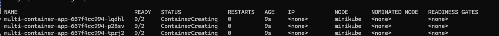

```

kubectl get pods -o wide
```

```
kubectl apply -f service-clusterip.yaml
```
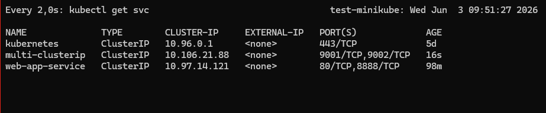
```
kubectl apply -f service-nodeport.yaml
```
   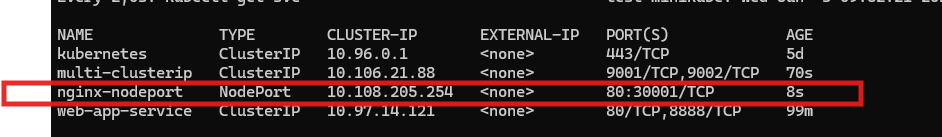
```
kubectl get svc 
```

# Проверка


## После применения манифестов
```
minikube ip   
```

## Проверка ClusterIP изнутри
```
kubectl run test-pod --image=wbitt/network-multitool --rm -it -- sh
```

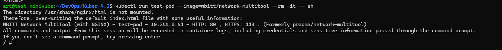


```
curl multi-clusterip:9001   # nginx
```
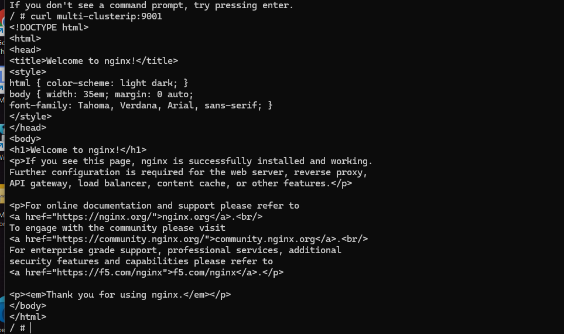
```
curl multi-clusterip:9002   # multitool
```


## Проверка NodePort снаружи


```
curl $(minikube ip):30001
```

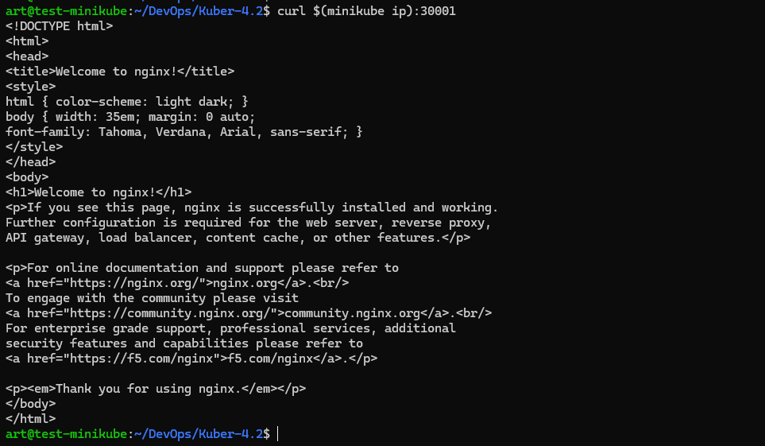


# Задание 2: Ingress
## Включите ingress в minikube:


Создали файлы: 
- deployment-backend.yaml
- deployment-frontend.yaml
- service-backend.yaml 
- service-frontend.yaml
- ingress.yaml


Применим  манифесты 
```
for file in $(ls); do  kubectl apply -f $file; done
```


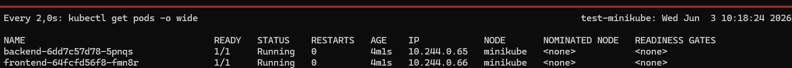


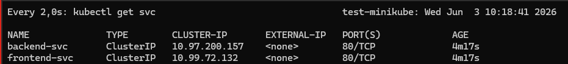

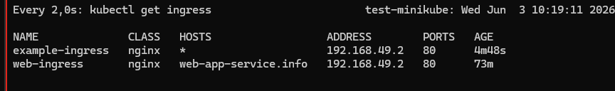


# Добавьте в /etc/hosts (или используйте curl --resolve)
# <minikube-ip> example.local

# Проверка
```
curl http://example.local/       # frontend (nginx)
curl http://example.local/api    # backend (multitool)
```


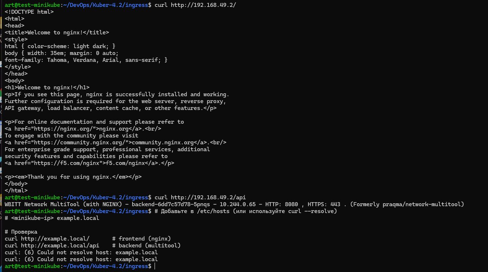


настроим Haproxy
haproxy.cfg
```

defaults
    mode http
    timeout client 30s
    timeout connect 5s
    timeout server 30s

frontend http-in
    bind 192.168.31.117:30000
    bind 127.0.0.1:80
    mode http

    use_backend multitool-backend if { path_beg /api/ }
    default_backend nginx-backend

backend nginx-backend
    mode http
    server minikube 192.168.49.2:80

backend multitool-backend
    mode http
    server minikube 192.168.49.2:80

listen stats
    bind *:8080
    mode http
    stats enable
    stats uri /stats
    stats auth admin:admin

```
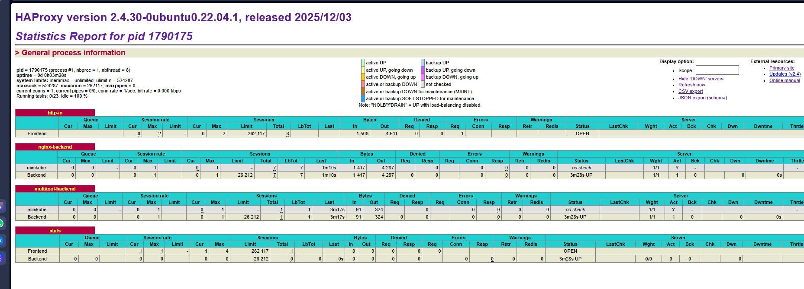